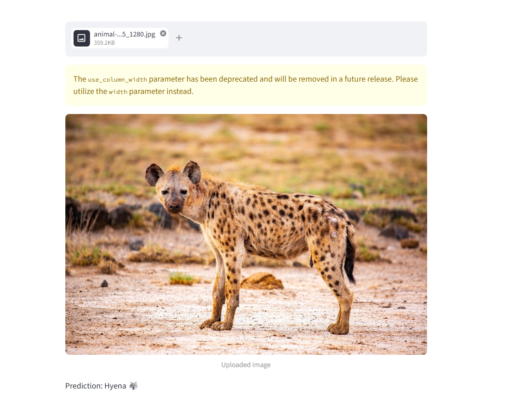

#  CNN Image Classification – Cheetah vs Hyena

This project implements a Convolutional Neural Network (CNN) to classify images of **Cheetahs ** and **Hyenas **.
The model is trained using image data and deployed using Streamlit for real-time predictions.

---

##  Features

* Image classification using CNN
* Binary classification (Cheetah vs Hyena)
* User-friendly Streamlit web app
* Upload image and get instant prediction

---

##  Technologies Used

* Python
* TensorFlow / Keras
* NumPy
* Streamlit
* PIL (Python Imaging Library)

---

##  How it Works

1. Images are resized to 128×128 pixels
2. CNN extracts features using convolution and pooling layers
3. Fully connected layers classify the image
4. Output layer predicts whether the image is a Cheetah or Hyena

---

##  How to Run

```bash
streamlit run app.py
```

---

##  Project Structure

```
CNN_Project/
│
├── dataset/
├── model.ipynb
├── app.py
├── screenshot.png
```

---

##  Output



The app allows users to upload an image and predicts whether it is:
- Cheetah 
- Hyena 

---

##  Model File Note

Due to GitHub file size limitations, the trained model file (`cnn_model.h5`) is not included in this repository.
However, the model can be recreated by running the provided notebook (`model.ipynb`).

---

##  Note

This is a basic prototype model trained on a limited dataset. Accuracy may vary for unseen images.
